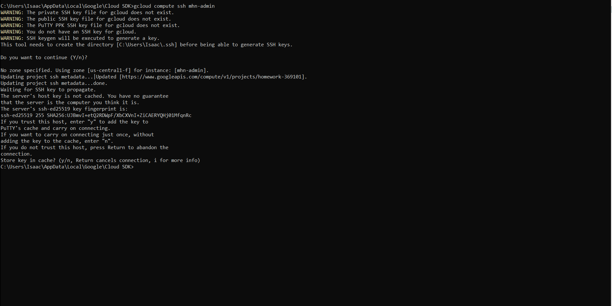

# Honeypot
**Time spent:** 5 hours spent in total

**Objective:** Create a honeynet using MHN-Admin. Present your findings as if you were requested to give a brief report of the current state of Internet security. Assume that your audience is a current employer who is questioning why the company should allocate anymore resources to the IT security team.

### MHN-Admin Deployment (Required)

**Summary:** How did you deploy it? Did you use GCP, AWS, Azure, Vagrant, VirtualBox, etc.?
I delopyed MHN-Admin using the Google Cloud Platform by installing GCP, setting the central project, its region and zone, setting up firewalls, and then creating the MHN-Admin VM with gcloud compute ssh mhn-admin.

### Dionaea Honeypot Deployment (Required)

**Summary:** Briefly in your own words, what does dionaea do?
Dionaea is a honeypot that attracts hackers through its services and traps the malware samples.

### Database Backup (Required) 

**Summary:** What is the RDBMS that MHN-Admin uses? What information does the exported JSON file record?
MHN-Admin uses MongoDB and the JSON file records the data collected from the Dionaea honeypot.

